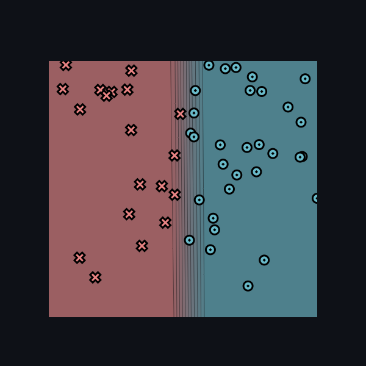
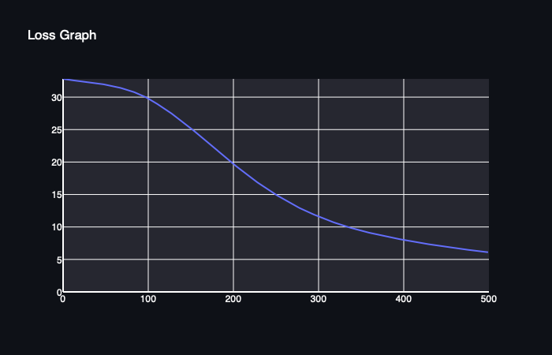
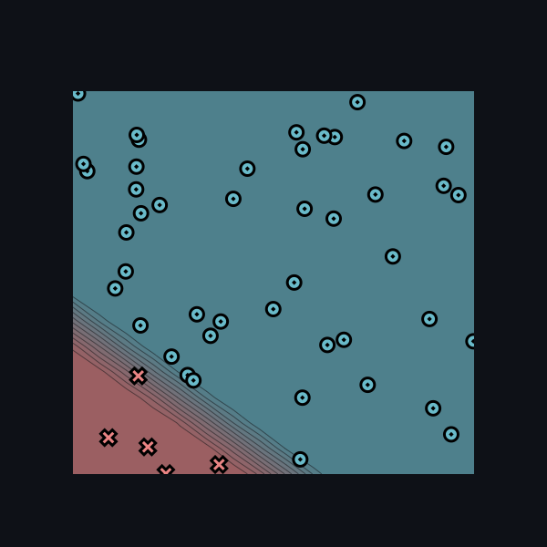
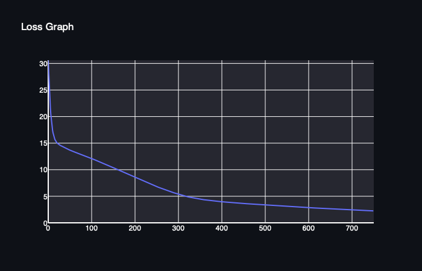
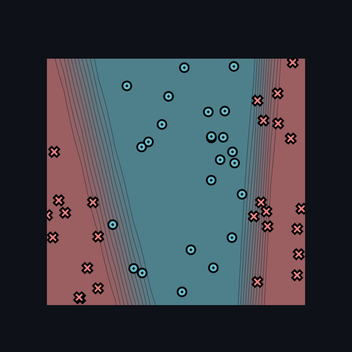
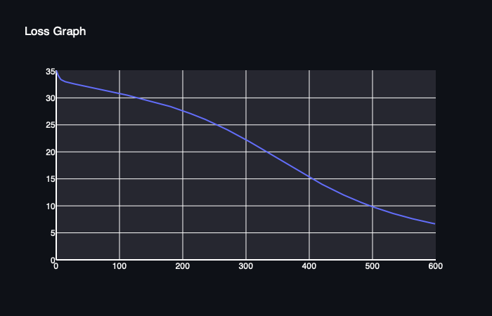
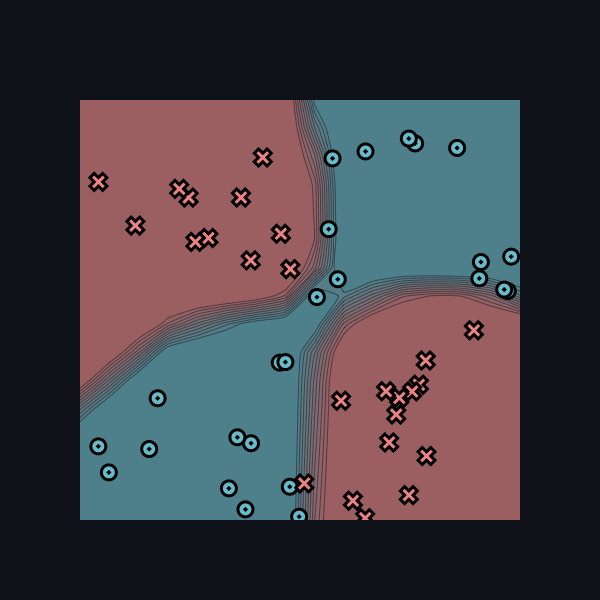
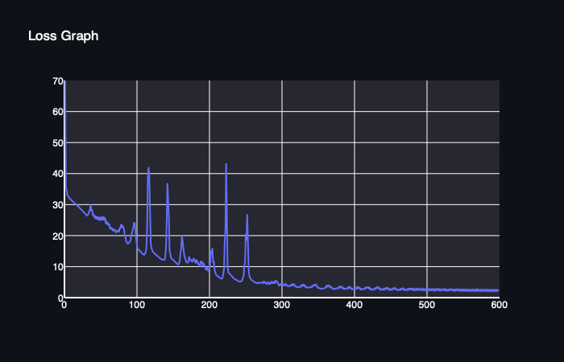
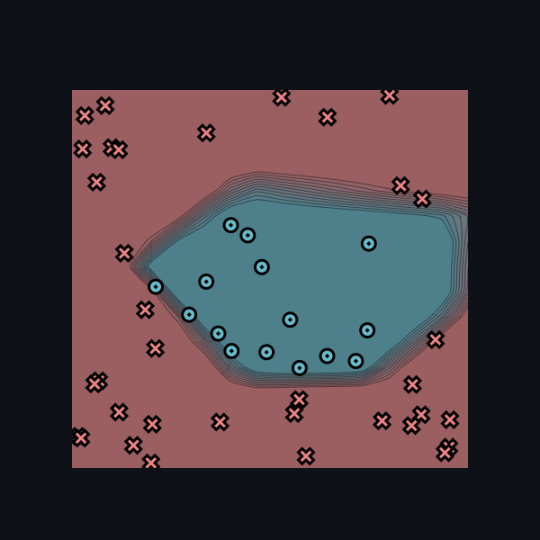
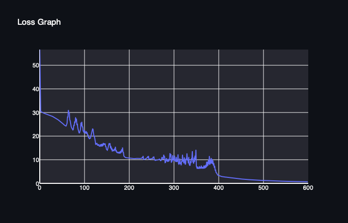

[](https://classroom.github.com/a/YFgwt0yY)
# MiniTorch Module 2


* Docs: https://minitorch.github.io/

* Overview: https://minitorch.github.io/module2/module2/

This assignment requires the following files from the previous assignments. You can get these by running

```bash
python sync_previous_module.py previous-module-dir current-module-dir
```

The files that will be synced are:

        minitorch/operators.py minitorch/module.py minitorch/autodiff.py minitorch/scalar.py minitorch/scalar_functions.py minitorch/module.py project/run_manual.py project/run_scalar.py project/datasets.py


# SIMPLE dataset



- Number of points: 50
- Size of hidden layer: 2
- Learning rate: 0.1
- Number of epochs: 500
- Time per epoch: 0.038s




| Epoch  | Loss               | Correct |
|--------|--------------------|---------|
| 0/500  | 0                  | 0       |
| 10/500 | 32.62358018678006  | 31      |
| 20/500 | 32.471571011697904 | 31      |
| 30/500 | 32.31825953213939  | 31      |
| 40/500 | 32.14268150633068  | 31      |
| 50/500 | 31.932598843028043 | 31      |
| 60/500 | 31.676474551266455 | 31      |
| 70/500 | 31.360577871789637 | 31      |
| 80/500 | 30.967434424587086 | 31      |
| 90/500 | 30.47464911769964  | 31      |
| 100/500| 29.854063175238966 | 31      |
| 110/500| 29.077813159472953 | 32      |
| 120/500| 28.232181829780483 | 33      |
| 130/500| 27.31156470887694  | 35      |
| 140/500| 26.313033199186528 | 38      |
| 150/500| 25.290620553727138 | 39      |
| 160/500| 24.245745593940576 | 39      |
| 170/500| 23.175675334380056 | 40      |
| 180/500| 22.03541468397026  | 41      |
| 190/500| 20.883284137809724 | 42      |
| 200/500| 19.7999839064204   | 42      |
| 210/500| 18.760470270494544 | 43      |
| 220/500| 17.72143912273905  | 44      |
| 230/500| 16.78984462483096  | 44      |
| 240/500| 15.897995805136798 | 44      |
| 250/500| 15.049078771786006 | 45      |
| 260/500| 14.26513757568084  | 45      |
| 270/500| 13.522211706262608 | 45      |
| 280/500| 12.83207638430585  | 45      |
| 290/500| 12.226968699955075 | 46      |
| 300/500| 11.66371272843765  | 46      |
| 310/500| 11.13924133761835  | 47      |
| 320/500| 10.650870142403997 | 47      |
| 330/500| 10.212601636902471 | 47      |
| 340/500| 9.817449667529361  | 47      |
| 350/500| 9.451532553656513  | 47      |
| 360/500| 9.127407909511703  | 47      |
| 370/500| 8.827502216396725  | 47      |
| 380/500| 8.54484565118351   | 47      |
| 390/500| 8.278042801267727  | 47      |
| 400/500| 8.025840177755658  | 47      |
| 410/500| 7.787318863841551  | 49      |
| 420/500| 7.561416538290714  | 49      |
| 430/500| 7.3469919590959    | 49      |
| 440/500| 7.143213506791755  | 49      |
| 450/500| 6.949309961896641  | 49      |
| 460/500| 6.764724263161992  | 49      |
| 470/500| 6.588790280797872  | 49      |
| 480/500| 6.420799025678556  | 49      |
| 490/500| 6.26022080081524   | 49      |
| 500/500| 6.106582015459176  | 49      |

---

# DIAG dataset



- Number of points: 50
- Size of hidden layer: 5
- Learning rate: 0.1
- Number of epochs: 750
- Time per epoch: 0.105s



| Epoch  | Loss               | Correct |
|--------|--------------------|---------|
| 10/750 | 17.97193502035294  | 45      |
| 20/750 | 15.176768070424444 | 45      |
| 30/750 | 14.518914398042622 | 45      |
| 40/750 | 14.119326316932359 | 45      |
| 50/750 | 13.713231070733382 | 45      |
| 60/750 | 13.377934680909028 | 45      |
| 70/750 | 13.075350431685138 | 45      |
| 80/750 | 12.766994466029425 | 45      |
| 90/750 | 12.452362381771716 | 45      |
| 100/750| 12.130582968183646 | 45      |
| 110/750| 11.800943064884377 | 45      |
| 120/750| 11.463951286713803 | 45      |
| 130/750| 11.119703425906033 | 45      |
| 140/750| 10.769032890952792 | 45      |
| 150/750| 10.41264956662633  | 45      |
| 160/750| 10.051848553362934 | 45      |
| 170/750| 9.687483753490572  | 45      |
| 180/750| 9.320855472162574  | 45      |
| 190/750| 8.953589397102864  | 45      |
| 200/750| 8.587557516120754  | 45      |
| 210/750| 8.224678107877615  | 45      |
| 220/750| 7.867087442133451  | 45      |
| 230/750| 7.517450976721214  | 45      |
| 240/750| 7.176745797677313  | 45      |
| 250/750| 6.84773855771409   | 46      |
| 260/750| 6.5313492278342835 | 46      |
| 270/750| 6.228613513220982  | 48      |
| 280/750| 5.940745717391474  | 48      |
| 290/750| 5.668420313381763  | 48      |
| 300/750| 5.412520451076773  | 48      |
| 310/750| 5.172084809236578  | 49      |
| 320/750| 4.947075269946052  | 49      |
| 330/750| 4.7683248502691    | 49      |
| 340/750| 4.612877841117297  | 49      |
| 350/750| 4.467268766389005  | 49      |
| 360/750| 4.34377720142197   | 49      |
| 370/750| 4.242036898817298  | 49      |
| 380/750| 4.147614815143724  | 49      |
| 390/750| 4.057815370522461  | 49      |
| 400/750| 3.9728398107047136 | 49      |
| 410/750| 3.897905475768828  | 49      |
| 420/750| 3.831043654432609  | 49      |
| 430/750| 3.7682436655766285 | 49      |
| 440/750| 3.706922198428367  | 49      |
| 450/750| 3.646849946558683  | 49      |
| 460/750| 3.587943051934604  | 49      |
| 470/750| 3.5301493541601454 | 49      |
| 480/750| 3.4734269303916823 | 49      |
| 490/750| 3.417739198236482  | 49      |
| 500/750| 3.3630466448955336 | 49      |
| 510/750| 3.309306810535303  | 49      |
| 520/750| 3.2564843742870484 | 49      |
| 530/750| 3.204537765340757  | 49      |
| 540/750| 3.1536083416646616 | 49      |
| 550/750| 3.1035462189071925 | 49      |
| 560/750| 3.054292916254275  | 49      |
| 570/750| 3.0058067260955394 | 49      |
| 580/750| 2.9580861438879977 | 49      |
| 590/750| 2.911083165451007  | 49      |
| 600/750| 2.8647916955938837 | 49      |
| 610/750| 2.819190782204684  | 49      |
| 620/750| 2.774258779754361  | 49      |
| 630/750| 2.730009377889187  | 49      |
| 640/750| 2.6863925369573614 | 49      |
| 650/750| 2.6434244995223897 | 49      |
| 660/750| 2.6010821969726754 | 49      |
| 670/750| 2.5593493873116584 | 49      |
| 680/750| 2.5182184553438263 | 49      |
| 690/750| 2.477696056420549  | 49      |
| 700/750| 2.4377590490995322 | 49      |
| 710/750| 2.398433720859963  | 49      |
| 720/750| 2.3596806538236246 | 49      |
| 730/750| 2.3214994464729357 | 49      |
| 740/750| 2.283884177546505  | 49      |
| 750/750| 2.246823517572851  | 49      |


---

# SPLIT dataset



- Number of points: 50
- Size of hidden layer: 5
- Learning rate: 0.5
- Number of epochs: 600
- Time per epoch: 0.104s




| Epoch  | Loss               | Correct |
|--------|--------------------|---------|
| 10/600 | 33.27128268672119  | 29      |
| 20/600 | 32.835323772325445 | 30      |
| 30/600 | 32.570922261246295 | 33      |
| 40/600 | 32.32126522147819  | 34      |
| 50/600 | 32.09393092323629  | 36      |
| 60/600 | 31.873352567073233 | 37      |
| 70/600 | 31.650345298378642 | 37      |
| 80/600 | 31.415704380573047 | 36      |
| 90/600 | 31.156833427538746 | 36      |
| 100/600| 30.882789006839854 | 36      |
| 110/600| 30.591461615837666 | 36      |
| 120/600| 30.288246756044675 | 35      |
| 130/600| 30.011359021406253 | 35      |
| 140/600| 29.73075971194874  | 35      |
| 150/600| 29.432500730304405 | 35      |
| 160/600| 29.123411579368753 | 35      |
| 170/600| 28.795869133940705 | 36      |
| 180/600| 28.442417234302717 | 36      |
| 190/600| 28.065290191446195 | 36      |
| 200/600| 27.65865971688188  | 36      |
| 210/600| 27.230694344305014 | 36      |
| 220/600| 26.787300503290222 | 37      |
| 230/600| 26.324649877963854 | 38      |
| 240/600| 25.83295004068839  | 38      |
| 250/600| 25.30302119836089  | 39      |
| 260/600| 24.750260543502854 | 40      |
| 270/600| 24.174765833482507 | 41      |
| 280/600| 23.575470852010998 | 44      |
| 290/600| 22.95294602426651  | 44      |
| 300/600| 22.308222229928155 | 46      |
| 310/600| 21.646787339892313 | 46      |
| 320/600| 20.96723463079404  | 46      |
| 330/600| 20.270908195101832 | 46      |
| 340/600| 19.56793042711921  | 46      |
| 350/600| 18.86246760467668  | 46      |
| 360/600| 18.149541183156554 | 47      |
| 370/600| 17.428833586763762 | 48      |
| 380/600| 16.724654319027277 | 48      |
| 390/600| 16.028056912777668 | 49      |
| 400/600| 15.352179282245494 | 50      |
| 410/600| 14.699169789109806 | 50      |
| 420/600| 14.064105797144759 | 50      |
| 430/600| 13.452530775215864 | 50      |
| 440/600| 12.866237350038979 | 50      |
| 450/600| 12.303073885296195 | 50      |
| 460/600| 11.764609849952361 | 50      |
| 470/600| 11.259844602970656 | 50      |
| 480/600| 10.773012993513825 | 50      |
| 490/600| 10.310668208935564 | 50      |
| 500/600| 9.875881141101134  | 50      |
| 510/600| 9.464558627991623  | 50      |
| 520/600| 9.075854023531763  | 50      |
| 530/600| 8.708873928371661  | 50      |
| 540/600| 8.362667319406887  | 50      |
| 550/600| 8.036236891141824  | 50      |
| 560/600| 7.728556379726199  | 50      |
| 570/600| 7.438588931782172  | 50      |
| 580/600| 7.165303907107039  | 50      |
| 590/600| 6.907690933328213  | 50      |
| 600/600| 6.664770875072767  | 50      |


---

# XOR dataset



- Number of points: 50
- Size of hidden layer: 10
- Learning rate: 0.5
- Number of epochs: 600
- Time per epoch: 0.287s




| Epoch  | Loss               | Correct |
|--------|--------------------|---------|
| 10/600 | 31.577958033543908 | 39      |
| 20/600 | 29.40981684790264  | 39      |
| 30/600 | 26.70377034187408  | 42      |
| 40/600 | 26.457696690494057 | 38      |
| 50/600 | 24.8157517130231   | 38      |
| 60/600 | 23.448054636155796 | 38      |
| 70/600 | 21.65105180560729  | 40      |
| 80/600 | 22.499118747159397 | 38      |
| 90/600 | 17.78853503093251  | 43      |
| 100/600| 18.501964725032963 | 43      |
| 110/600| 13.930387974942397 | 44      |
| 120/600| 17.5854404601455   | 44      |
| 130/600| 13.249583911944278 | 44      |
| 140/600| 13.113739055477438 | 43      |
| 150/600| 12.299072772572089 | 45      |
| 160/600| 11.777515587371262 | 44      |
| 170/600| 11.372129096428763 | 45      |
| 180/600| 11.834169237616116 | 44      |
| 190/600| 11.123296872359179 | 43      |
| 200/600| 8.434395232514348  | 47      |
| 210/600| 7.430381727029927  | 47      |
| 220/600| 7.618928825320915  | 47      |
| 230/600| 7.27869807743565   | 47      |
| 240/600| 5.422090701513439  | 49      |
| 250/600| 11.208045027989373 | 45      |
| 260/600| 5.464898855842745  | 48      |
| 270/600| 4.884714556360002  | 49      |
| 280/600| 4.718758841876581  | 49      |
| 290/600| 4.89458258567392   | 49      |
| 300/600| 4.651593434735633  | 49      |
| 310/600| 3.7875731447376744 | 49      |
| 320/600| 3.7832489231295767 | 49      |
| 330/600| 4.320482677203982  | 49      |
| 340/600| 3.4089814858050382 | 49      |
| 350/600| 3.5483515328536996 | 49      |
| 360/600| 3.1960953938149146 | 49      |
| 370/600| 3.145802058455515  | 49      |
| 380/600| 3.5241869931267273 | 49      |
| 390/600| 2.991302341334032  | 49      |
| 400/600| 2.8068805167659687 | 49      |
| 410/600| 2.8666826383966777 | 49      |
| 420/600| 3.542732017050294  | 49      |
| 430/600| 3.2442751592425254 | 49      |
| 440/600| 2.7603693389957535 | 49      |
| 450/600| 2.6682875311626644 | 49      |
| 460/600| 2.6308671619701367 | 49      |
| 470/600| 2.699021166457527  | 49      |
| 480/600| 3.023067006909153  | 49      |
| 490/600| 2.8975080723256514 | 49      |
| 500/600| 2.9073141519167316 | 49      |
| 510/600| 2.6546829170552844 | 49      |
| 520/600| 2.6213177133252388 | 49      |
| 530/600| 2.575238503806526  | 49      |
| 540/600| 2.720056205420405  | 49      |
| 550/600| 2.638477737656886  | 49      |
| 560/600| 2.5510662338247707 | 49      |
| 570/600| 2.6180183176887892 | 49      |
| 580/600| 2.551895912446727  | 49      |
| 590/600| 2.592715611111808  | 49      |
| 600/600| 2.5867891441893396 | 49      |


---

# CIRCLE dataset



- Number of points: 50
- Size of hidden layer: 13
- Learning rate: 0.5
- Number of epochs: 600
- Time per epoch: 0.427s





| Epoch  | Loss               | Correct |
|--------|--------------------|---------|
| 10/600 | 29.718877073897385 | 35      |
| 20/600 | 29.079094863315596 | 35      |
| 30/600 | 28.282103351858265 | 35      |
| 40/600 | 27.167159044578273 | 35      |
| 50/600 | 25.686406308082667 | 35      |
| 60/600 | 24.294769551675557 | 36      |
| 70/600 | 24.812223371227063 | 43      |
| 80/600 | 25.548007007756834 | 42      |
| 90/600 | 21.43859691000065  | 43      |
| 100/600| 21.372896319608994 | 42      |
| 110/600| 19.204649445979047 | 43      |
| 120/600| 22.94832531192018  | 40      |
| 130/600| 16.024077198920654 | 44      |
| 140/600| 15.584388187179579 | 43      |
| 150/600| 14.463557739593105 | 44      |
| 160/600| 15.818238409621104 | 43      |
| 170/600| 15.482286823507753 | 43      |
| 180/600| 13.439278524039594 | 44      |
| 190/600| 11.299917412079685 | 46      |
| 200/600| 10.639435743073555 | 45      |
| 210/600| 10.46216761027015  | 46      |
| 220/600| 10.533220864254304 | 45      |
| 230/600| 10.94817260255418  | 45      |
| 240/600| 10.759278894758008 | 45      |
| 250/600| 10.454827914126273 | 45      |
| 260/600| 9.793938065396876  | 45      |
| 270/600| 9.82968932508749   | 46      |
| 280/600| 11.420876774313085 | 45      |
| 290/600| 9.569298765962085  | 46      |
| 300/600| 10.291579615264004 | 45      |
| 310/600| 12.267813516786136 | 44      |
| 320/600| 12.115910695961848 | 44      |
| 330/600| 12.697704908449307 | 44      |
| 340/600| 10.633483472683782 | 45      |
| 350/600| 14.209731887324304 | 43      |
| 360/600| 6.877590679378752  | 47      |
| 370/600| 7.51688082641208   | 47      |
| 380/600| 11.56959632181632  | 44      |
| 390/600| 8.549188559966995  | 45      |
| 400/600| 3.392976232570228  | 50      |
| 410/600| 2.817810273706039  | 50      |
| 420/600| 2.5709181776798156 | 50      |
| 430/600| 2.3319657480868963 | 50      |
| 440/600| 2.1015325852706273 | 50      |
| 450/600| 1.8600347232703704 | 50      |
| 460/600| 1.6915283539007822 | 50      |
| 470/600| 1.5467904591967705 | 50      |
| 480/600| 1.4373888301398947 | 50      |
| 490/600| 1.3133875479791597 | 50      |
| 500/600| 1.228775761483486  | 50      |
| 510/600| 1.134881748123938  | 50      |
| 520/600| 1.0562723527202915 | 50      |
| 530/600| 0.9955492676234776 | 50      |
| 540/600| 0.9313237360451743 | 50      |
| 550/600| 0.8764961933494236 | 50      |
| 560/600| 0.8152504536839064 | 50      |
| 570/600| 0.7785676178391645 | 50      |
| 580/600| 0.7380240543766255 | 50      |
| 590/600| 0.6988499213321782 | 50      |
| 600/600| 0.6625173538171226 | 50      |
